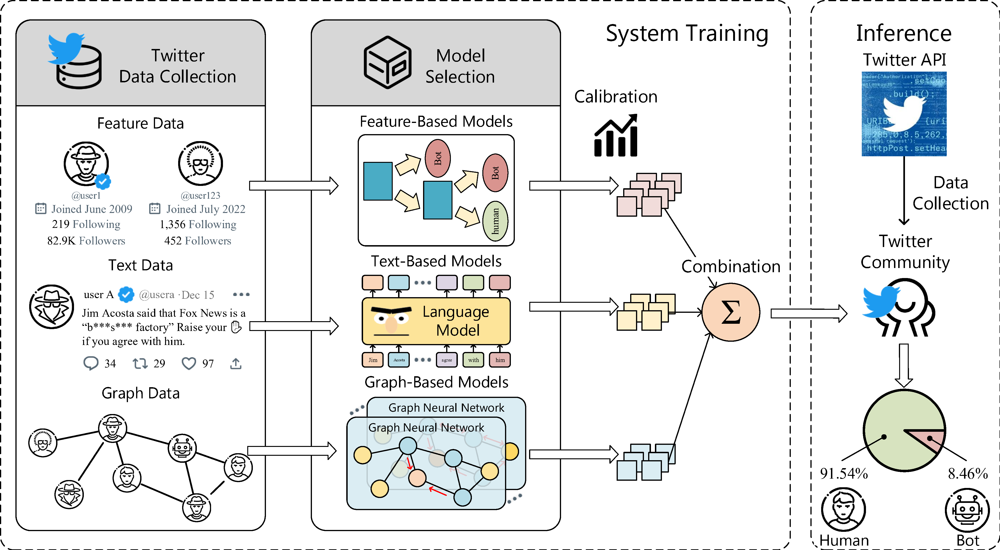

# BotPercent: Estimating Twitter Bot Populations from Groups to Crowds

This is a demo of the paper

**BotPercent: Estimating Twitter Bot Populations from Groups to Crowds**.
<!-- [BotPercent: Estimating Twitter Bot Populations from Groups to Crowds][paper].

[paper]: https://arxiv.org/pdf/2106.06935.pdf -->
*work in progress*

Twitter bot detection has become increasingly important in combating misinformation, identifying malicious online campaigns, and protecting the integrity of social media discourse. While existing bot detection literature mostly focuses on identifying individual bots, it remains underexplored how to estimate the proportion of bots within specific communities and social networks, which has great implications for both content moderators and day-to-day users. In this work, we propose **community-level bot detection**, a novel approach to estimating the amount of malicious interference in online communities by estimating the percentage of bot accounts. Specifically, we introduce **BotPercent**, an amalgamation of Twitter bot-detection datasets and feature-, text-, and graph-based models that overcome generalization issues in existing individual-level models, resulting in a more accurate community-level bot estimation. Experiments demonstrate that **BotPercent** achieves state-of-the-art community-level bot detection performance on the TwiBot-22 benchmark while showing great robustness towards the tampering of specific user features. Armed with **BotPercent**, we analyze bot rates in different Twitter groups and communities, such as all active Twitter users, users that interact with partisan news media, users that participate in Elon Musk's content moderation votes, and the political communities in different countries and regions. Our experimental results demonstrate that the existence of Twitter bots is not homogeneous, but rather a spatial-temporal distribution whose heterogeneity should be taken into account for content moderation, social media policy making, and more.

## Overview ##

* BotPercent is a multi-dataset multi-model community-oriented Twitter bot detection pipeline. 
* For training data, we merge all publicly available datasets, including Cresci-15, Galani-17, Cresci-17, Midterm-18, Cresci-stock-18, Cresci-rtbust-19, Botometer-feedback-19, TwiBot-20, and TwiBot-22.
* For model architecture, we combine the feature-, text-, and graph-based methods to merge their inductive bias.



## Installation ##
Please install the dependencies via pip, using the following command:

```bash
pip install torch==1.9.0
pip install tweepy==4.12.1
pip install transformers==4.24.0
pip install scikit-learn==0.24.0
pip install numpy==1.19.5
pip install vaderSentiment==3.3.2
pip install spacy==3.2.4
pip install sentencepiece==0.1.97
```

## Run the Pipeline ##
1. Download the Random Forest checkpoint [here](https://drive.google.com/file/d/1-sZXntdHimn6cq8WpGWMBAmpnENgWJKq/view?usp=sharing), and place it in the *checkpoint* folder.
2. Open the *api.json* file and enter your Twitter API key, which can be obtained from [here](https://developer.twitter.com/en/docs/twitter-api).
3. To detect a specific user (with *username*), please run the following command

```bash
python pipeline-api.py --username username --device cpu
```


